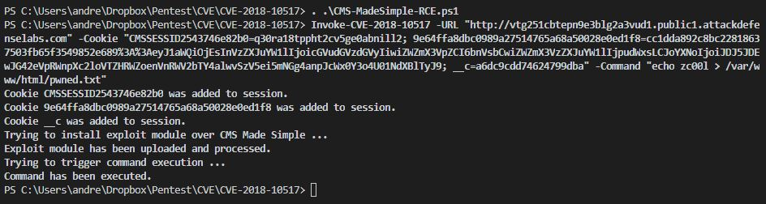

# CVE-2018-12613
Authenticated remote command execution by uploading a fake module, dropping PHP files on remote web server.

# Software Affected
1. CMS Made Simple 2.2.7;

# How to use
This PowerShell scripts need two parameters to craft a exploit HTTP request:

    1. CMS Made Simple URL endpoint;
    2. Cookies for unauthenticated user;
    2. A command string to be executed in the remote system shell;

# Example

Prepare all the parameters to use the script:

Then command is executed.

Code author: @_zc00l